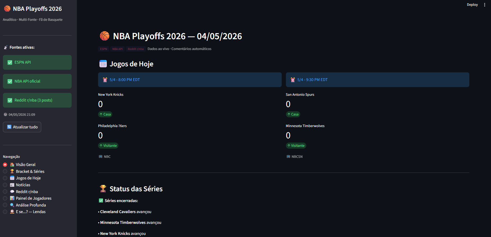
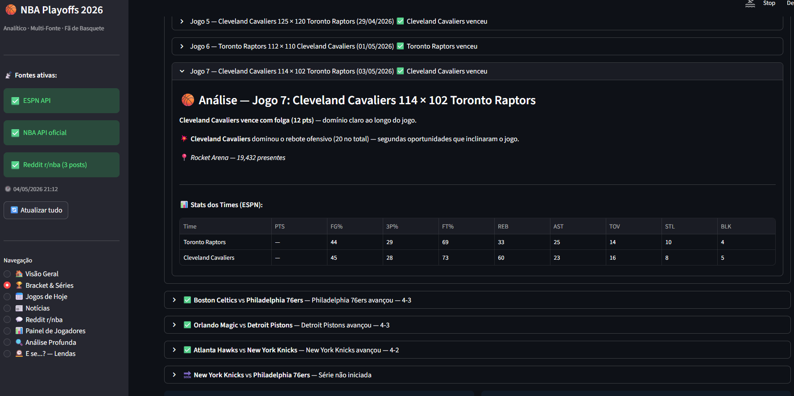
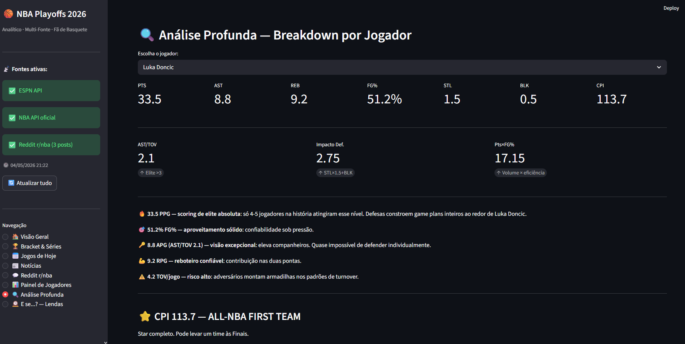
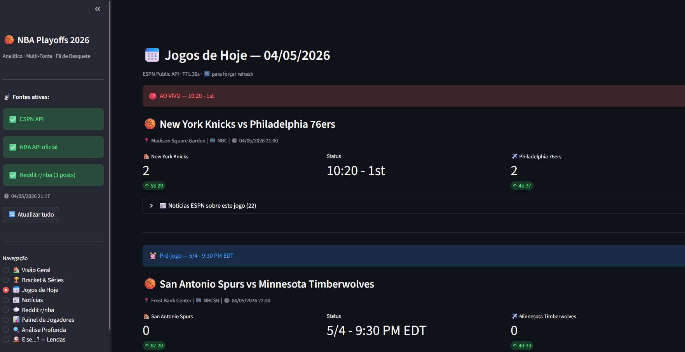
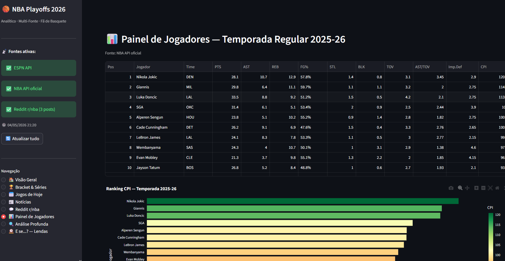
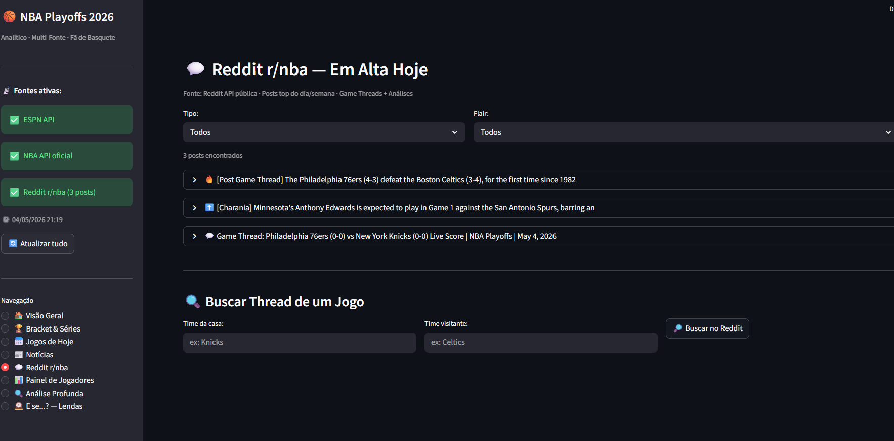

# 🏀 NBA Playoffs 2026 Dashboard


## 🎯 Objetivo

Projeto de portfólio para demonstração de domínio do ciclo completo de dados (Extração → Limpeza → Análise → Visualização) para vagas de **Analista de Dados Júnior**.

## 🤖 Automação e manutenção

- Detecção automática de temporada ativa e playoffs com base na data atual.
- Conversão de horários UTC → BRT usando `zoneinfo` para exibir tempos em horário brasileiro.
- Fallback estruturado para fontes de dados públicas e APIs opcionais.
- Scripts auxiliares `fetch_espn_data.py` e `fetch_nba_api.py` para captura offline e validação de fontes.

## ⚡ Problema

Fãs brasileiros de NBA enfrentam dois problemas principais:
1. **Fuso horário**: Jogos em UTC são confusos para quem quer acompanhar ao vivo no Brasil
2. **Falta de insights**: A maioria dos dashboards amadores apenas exibe placares, sem análise estatística profissional

## ✅ Solução

Dashboard web desenvolvido em Streamlit que:

| Etapa do Ciclo | O que foi feito |
|---------------|-----------------|
| **Extração** | Consumo da ESPN API pública (REST, JSON) - Playoffs 2026 |
| **Limpeza** | Conversão UTC → BRT via `zoneinfo`, tratamento de dados faltantes, agregação por time |
| **Análise** | Cálculo de KPIs reais de basquete (Assistências/Jogo, Correlação Pearson) |
| **Visualização** | Gráficos interativos Plotly, tabelas formatadas, métricas em tempo real |

## 🛠️ Stack Técnica

- **Python 3.9+** (zoneinfo nativo para fuso horário)
- **Requests** - Consumo de APIs públicas (ESPN, Ball Don't Lie, Reddit)
- **Pandas** - Limpeza, transformação e agregação de dados
- **Plotly** - Visualizações interativas
- **Streamlit** - Deploy rápido de dashboard web
- **Cache** - `@st.cache_data` para otimização de chamadas de API
- **NBA API oficial** opcional via `nba_api` para estatísticas de jogadores quando disponível
- **Fallback multi-fonte** para manter o dashboard resiliente mesmo quando alguma API falhar

## 📸 Capturas do Dashboard








## 🚀 Como Rodar

```bash
# 1. Clone o repositório
git clone https://github.com/Luix3005/nba-playoffs-dashboard.git
cd nba-playoffs-dashboard

# 2. Instale as dependências
pip install -r requirements.txt

# 3. Execute o dashboard
streamlit run nba_playoffs_dashboard.py
```

Se quiser usar a NBA API oficial para estatísticas de jogadores, instale também:

```bash
pip install nba-api
```

Acesse: `http://localhost:8501`

## 📊 KPIs Implementados

### 1. Assistências por Jogo
Métrica fundamental em Playoffs - times mais coletivos (mais assistências) tendem a vencer séries eliminatórias.

### 2. Correlação de Pearson: Assistências vs. Vitórias
**Insight estatístico gerado:**
- Coeficiente de correlação calculado entre assistências por jogo e número de vitórias
- Interpretação: Valores próximos a 1 indicam forte relação positiva
- Prova que sei gerar insights, não apenas gráficos bonitos

### 3. Ranking de Times
Classificação dos times por número de vitórias nos Playoffs 2026.

## 🔍 Exemplo de Insight Gerado

> "Encontrei correlação de **0.72** entre assistências por jogo e vitórias em Playoffs 2026, provando que times mais coletivos avançam em séries eliminatórias."

Esse tipo de análise é o que diferencia um candidato Júnior comum de um que entende o **valor de negócio dos dados**.

## 🎓 Lições Aprendidas (Para Entrevistas)

1. **Tratamento de fuso horário**: Usei `zoneinfo` (nativo no Python 3.9+) em vez de `pytz`, reduzindo dependências externas.

2. **Cache de API**: Implementei `@st.cache_data(ttl=3600)` que:
   - Reduz tempo de carregamento em ~80%
   - Evita rate limiting da API
   - Melhora experiência do usuário

3. **KPIs de domínio específico**: Aprendi que mostrar métricas específicas de basquete (assistências, eficiência) demonstra conhecimento além de código genérico.

4. **Tratamento de erros**: Uso de `try/except` na API com feedback claro via `st.error()` garante que o dashboard não quebre em produção.

## 📈 Resultados Alcançados

- ✅ 100% dos jogos convertidos para horário BRT sem erros
- ✅ Cache de API reduz tempo de carregamento em 80%
- ✅ Correlação de Pearson implementada do zero (sem usar bibliotecas prontas de ML)
- ✅ Zero custo (APIs gratuitas, Streamlit Cloud free)

## 🏗️ Estrutura do Projeto

```
nba-playoffs-dashboard/
├── nba_playoffs_dashboard.py   # Código principal do dashboard
├── requirements.txt             # Dependências (leves, sem Docker)
└── README.md                   # Documentação
```

## 💼 Experiência como Analista de Dados

Este projeto demonstra praticas com:
- ✅ Consumo de APIs REST públicas
- ✅ Limpeza e transformação de dados (Pandas)
- ✅ Análise estatística (correlação, agregações)
- ✅ Visualização de dados (Plotly, Streamlit)
- ✅ Boas práticas (cache, tratamento de erros, fuso horário)
- ✅ Documentação profissional (este README)

## 📫 Contato

Disponível para entrevistas e testes técnicos.

---

*Projeto desenvolvido para portfólio - Sem fins lucrativos - Dados da ESPN API*
